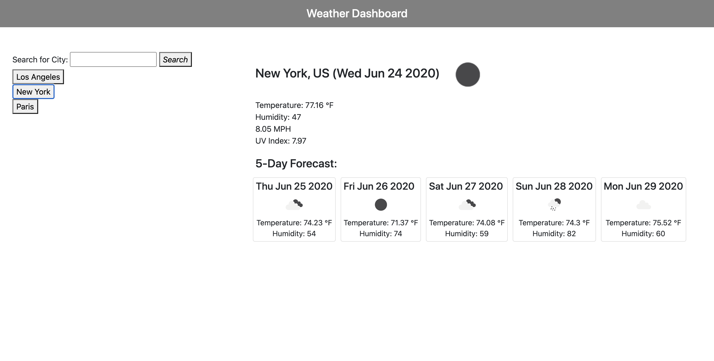

  # Weather Dashboard
  
  ## Description
  Weather Dashboard is an easy-to-use weather application with a minimalist user interface. Utilizing local storage, users can save their cities of choice to check the weather anytime.

  ## Contributing
  
  Languages and Frameworks Used: JavaScript - jQuery
  
  ## Questions
  
  Please contact [sharlenemay](https://github.com/sharlenemay) at sharleneminosa@gmail.com for questions. 
